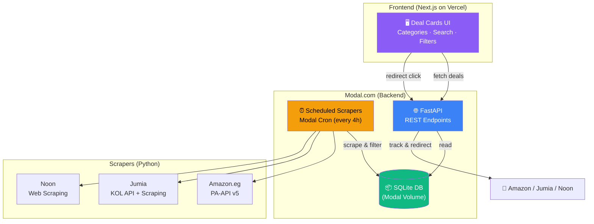

# Egyptian Deals Aggregator — Implementation Plan

> **Codename:** Sooq Deals  
> **Goal:** Build an MVP deals aggregator for the Egyptian market that surfaces discounted products (≥15% off) from Amazon.eg, Jumia, and Noon — monetized via affiliate commissions.

## Architecture Overview



---

## User Review Required

> [!IMPORTANT]
> **Amazon.eg Associates is currently private/invite-only.** You may need to apply through the general Amazon Associates program first, or reach out directly. The MVP website should still be built to meet their approval criteria (original content, professional design, privacy policy, affiliate disclosure).

> [!WARNING]
> **Scraping legality:** Amazon, Noon, and Jumia all prohibit scraping in their ToS. Our approach is:
> - **Amazon.eg** → Use the official **Product Advertising API (PA-API v5)** — fully compliant
> - **Jumia** → Use the **Jumia KOL Affiliates API** (GitHub) — grey area but commonly used
> - **Noon** → **Web scraping only** (no public API) — highest risk; consider starting without Noon in the MVP and adding it later, or using only their official promo codes
>
> **Recommendation:** Launch MVP with **Amazon.eg + Jumia only**. Add Noon in Phase 2 once revenue validates the model.

> [!CAUTION]
> **Amazon requires 3 qualifying sales within 180 days** of approval, or your account gets terminated. Build the site to look professional and drive real traffic from day one.

---

## Proposed Changes

### Component 1: Modal Backend

The backend runs entirely on Modal.com — FastAPI for the API, scheduled functions for scraping, and a persistent volume for SQLite storage.

---

#### [NEW] [app.py](file:///d:/Antigravity/Projects/BE-/tools/app.py)

Main Modal application file. Defines the Modal App, image, volume, and FastAPI web endpoint.

```python
import modal

app = modal.App("sooq-deals")

image = modal.Image.debian_slim(python_version="3.11").pip_install(
    "fastapi", "uvicorn", "httpx", "beautifulsoup4",
    "lxml", "pydantic", "python-dotenv"
)

volume = modal.Volume.from_name("sooq-deals-db", create_if_missing=True)
DB_PATH = "/data/sooq_deals.db"
```

---

#### [NEW] [database.py](file:///d:/Antigravity/Projects/BE-/tools/database.py)

SQLite database layer with schema creation and CRUD operations.

**Database Schema:**

```sql
-- Products: master record per product
CREATE TABLE IF NOT EXISTS products (
    id            TEXT PRIMARY KEY,        -- "{source}_{external_id}"
    source        TEXT NOT NULL,           -- "amazon", "jumia", "noon"
    external_id   TEXT NOT NULL,           -- platform-specific ID (ASIN, SKU)
    title         TEXT NOT NULL,
    title_ar      TEXT,                    -- Arabic title (future)
    description   TEXT,
    image_url     TEXT,
    category      TEXT,
    brand         TEXT,
    url           TEXT NOT NULL,           -- original product URL
    affiliate_url TEXT,                    -- URL with affiliate tag
    current_price REAL NOT NULL,           -- in EGP
    original_price REAL,                   -- before discount, in EGP
    discount_pct  REAL,                    -- calculated: ((orig - curr) / orig) * 100
    currency      TEXT DEFAULT 'EGP',
    rating        REAL,
    review_count  INTEGER,
    in_stock      INTEGER DEFAULT 1,
    is_active     INTEGER DEFAULT 1,       -- 0 = deal expired
    first_seen    TEXT NOT NULL,           -- ISO datetime
    last_updated  TEXT NOT NULL,           -- ISO datetime
    created_at    TEXT DEFAULT CURRENT_TIMESTAMP
);

-- Click tracking for analytics
CREATE TABLE IF NOT EXISTS clicks (
    id          INTEGER PRIMARY KEY AUTOINCREMENT,
    product_id  TEXT NOT NULL,
    user_ip     TEXT,
    user_agent  TEXT,
    referrer    TEXT,
    clicked_at  TEXT DEFAULT CURRENT_TIMESTAMP,
    FOREIGN KEY (product_id) REFERENCES products(id)
);

-- Scrape history for monitoring
CREATE TABLE IF NOT EXISTS scrape_logs (
    id            INTEGER PRIMARY KEY AUTOINCREMENT,
    source        TEXT NOT NULL,
    status        TEXT NOT NULL,       -- "success", "partial", "failed"
    products_found INTEGER DEFAULT 0,
    deals_found   INTEGER DEFAULT 0,
    error_message TEXT,
    duration_sec  REAL,
    scraped_at    TEXT DEFAULT CURRENT_TIMESTAMP
);

-- Indexes
CREATE INDEX IF NOT EXISTS idx_products_source ON products(source);
CREATE INDEX IF NOT EXISTS idx_products_category ON products(category);
CREATE INDEX IF NOT EXISTS idx_products_discount ON products(discount_pct);
CREATE INDEX IF NOT EXISTS idx_products_active ON products(is_active);
CREATE INDEX IF NOT EXISTS idx_clicks_product ON clicks(product_id);
```

---

#### [NEW] [scrapers/amazon_scraper.py](file:///d:/Antigravity/Projects/BE-/tools/scrapers/amazon_scraper.py)

Amazon.eg scraper using PA-API v5 (requires Associates account + API credentials).

- Searches by category for deals/sale items
- Uses `SearchItems` and `GetItems` operations
- Filters for `discount_pct >= 15`
- Generates affiliate URLs with `tag=yourtag-21`
- Falls back to curated deal page scraping if API not yet available

---

#### [NEW] [scrapers/jumia_scraper.py](file:///d:/Antigravity/Projects/BE-/tools/scrapers/jumia_scraper.py)

Jumia scraper using two strategies:

1. **Primary:** Jumia KOL Affiliates API — fetches product details and generates affiliate links
2. **Fallback:** HTTP scraping of `jumia.com.eg/mlp-deals/` and category pages
   - Uses `httpx` + `BeautifulSoup`
   - Extracts: title, old price, new price, image, link, ratings
   - Calculates discount percentage
   - Adds affiliate tag to URLs

---

#### [NEW] [scrapers/noon_scraper.py](file:///d:/Antigravity/Projects/BE-/tools/scrapers/noon_scraper.py)

> **Phase 2 only** — not in MVP

Noon web scraper targeting `noon.com/egypt-en/deals/` pages:
- Uses `httpx` with browser-like headers + rotating user agents
- Parses product cards for price, was-price, title, image
- Calculates discount percentage
- Rate-limited with random delays (2-5s between requests)

---

#### [NEW] [scrapers/base.py](file:///d:/Antigravity/Projects/BE-/tools/scrapers/base.py)

Base scraper class with shared logic:
- Discount calculation: `((original - current) / original) * 100`
- Minimum discount filter (configurable, default 15%)
- Deduplication by `source + external_id`
- Error handling and retry logic
- Result normalization to `Product` Pydantic model

---

#### [NEW] [api.py](file:///d:/Antigravity/Projects/BE-/tools/api.py)

FastAPI routes deployed as a Modal web endpoint:

| Method | Path | Description |
|--------|------|-------------|
| `GET` | `/api/deals` | List active deals (paginated, filterable) |
| `GET` | `/api/deals/{id}` | Get single deal details |
| `GET` | `/api/categories` | List available categories |
| `GET` | `/api/search?q=` | Full-text search deals |
| `GET` | `/api/stats` | Public stats (total deals, last updated) |
| `GET` | `/go/{id}` | **Redirect** — logs click → redirects to affiliate URL |
| `GET` | `/health` | Health check |

**Query parameters for `/api/deals`:**
- `source` — filter by platform (amazon, jumia, noon)
- `category` — filter by category
- `min_discount` — minimum discount % (default: 15)
- `sort` — `newest`, `discount`, `price_low`, `price_high`
- `page` / `limit` — pagination (default: 20 per page)

**CORS:** Allow frontend origin(s) only.

---

#### [NEW] [scheduler.py](file:///d:/Antigravity/Projects/BE-/tools/scheduler.py)

Modal scheduled functions:

```python
@app.function(schedule=modal.Period(hours=4), volumes={"/data": volume})
def scrape_all():
    """Run all scrapers, update DB, deactivate expired deals."""
    ...

@app.function(schedule=modal.Period(hours=24), volumes={"/data": volume})  
def cleanup_expired():
    """Mark deals older than 48h without price update as inactive."""
    ...
```

---

### Component 2: Frontend (Next.js)

A responsive, SEO-optimized website designed to meet Amazon Associates approval criteria.

---

#### [NEW] [frontend/](file:///d:/Antigravity/Projects/BE-/frontend/)

Next.js app created with `npx create-next-app@latest`:

| Page/Component | Purpose |
|----------------|---------|
| `app/page.tsx` | Homepage — hero + featured deals grid |
| `app/deals/page.tsx` | All deals with filters/search |
| `app/category/[slug]/page.tsx` | Deals filtered by category |
| `app/about/page.tsx` | About page (required for affiliate approval) |
| `app/privacy/page.tsx` | Privacy policy (required for Amazon) |
| `app/disclaimer/page.tsx` | Affiliate disclosure (required for Amazon) |
| `components/DealCard.tsx` | Product card with image, prices, discount badge |
| `components/Header.tsx` | Nav bar with search + category links |
| `components/Footer.tsx` | Footer with legal links |
| `components/FilterSidebar.tsx` | Source/category/discount filters |
| `components/SearchBar.tsx` | Search input with debounced API calls |

**Design principles:**
- Dark mode by default (modern, premium feel)
- Vibrant accent colors per store (Amazon orange, Jumia pink, Noon yellow)
- Discount badges with glassmorphism effect
- Smooth hover animations on deal cards
- Mobile-first responsive layout
- Prices displayed in EGP (ج.م)
- "Shop Now" button redirects via `/go/{id}` for click tracking

---

### Component 3: Configuration & Legal

---

#### [MODIFY] [.env](file:///d:/Antigravity/Projects/BE-/.env)

Add required environment variables:

```env
# Amazon PA-API v5
AMAZON_ACCESS_KEY=
AMAZON_SECRET_KEY=
AMAZON_PARTNER_TAG=
AMAZON_REGION=eu-west-1

# Jumia
JUMIA_KOL_ID=
JUMIA_AFFILIATE_TAG=

# Noon (future)
NOON_AFFILIATE_CODE=

# Modal
MODAL_TOKEN_ID=
MODAL_TOKEN_SECRET=

# App
MIN_DISCOUNT_PCT=15
SCRAPE_INTERVAL_HOURS=4
DATABASE_PATH=/data/sooq_deals.db
FRONTEND_URL=https://sooqdeals.com
```

---

#### [NEW] [architecture/data-flow.md](file:///d:/Antigravity/Projects/BE-/architecture/data-flow.md)

SOP for the scraping → processing → serving data pipeline (Layer 1 of A.N.T.).

---

#### [NEW] [architecture/affiliate-links.md](file:///d:/Antigravity/Projects/BE-/architecture/affiliate-links.md)

SOP for affiliate link generation rules per platform, click tracking, and redirect logic.

---

## MVP Definition

The **MVP** includes:
- ✅ Amazon.eg deals via PA-API v5 (or manual curation if API not yet accessible)
- ✅ Jumia deals via KOL API
- ❌ Noon (deferred to Phase 2)
- ✅ Responsive frontend with deal listing, categories, search
- ✅ Click tracking and affiliate redirects
- ✅ Privacy policy + affiliate disclosure pages
- ✅ Deployed on Modal (backend) + Vercel (frontend)

---

## Verification Plan

### Automated Tests

**Backend unit tests** (run on Modal or locally):

```bash
# From BE-/tools directory
python -m pytest tests/ -v
```

Tests to write:
- `test_database.py` — schema creation, CRUD, deduplication
- `test_discount_calc.py` — discount % edge cases (0, negative, missing original price)
- `test_api.py` — endpoint responses, pagination, filtering, CORS headers
- `test_affiliate_links.py` — correct tag insertion per platform

### Browser Verification

Using the browser tool, verify:
1. **Homepage loads** — deal cards render with images, prices, discount badges
2. **Filtering works** — select a source/category, verify correct results
3. **Redirect flow** — click "Shop Now" → confirm redirect hits `/go/{id}` → lands on affiliate URL
4. **Mobile layout** — resize browser and confirm responsive design
5. **Legal pages** — privacy policy and affiliate disclosure pages render fully

### Manual Verification (User)

1. **Amazon Associates application** — submit site URL for review
2. **Affiliate link test** — click a deal, purchase a small item, confirm commission appears in affiliate dashboard
3. **Scraper output** — review `.tmp/scrape_output.json` to verify deal quality and accuracy
